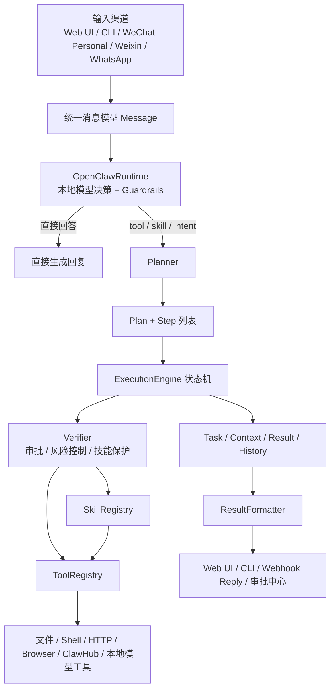

# LocalClaw

LocalClaw 是一个本地优先、单机优先、低成本优先的 Agent Runtime。

它把 Web UI、CLI、个人微信桥接、Weixin webhook、WhatsApp Cloud API webhook 等输入统一收敛成内部 `Message`，再优先交给本地大模型理解，最后通过 `Planner -> ExecutionEngine -> Verifier -> Tool/Skill` 链路完成执行，并把结果回送到当前渠道。

它不是一个“把所有能力都塞进核心代码里”的大一统平台，而更像一个可控的本地运行时骨架：

- 本地大模型负责统一理解与路由
- Tool 是唯一实际执行入口
- Skill 是声明式能力扩展层
- 高风险操作进入审批或保护策略
- Web UI 是主控制台，CLI/消息渠道是辅助入口

一句话理解：

> LocalClaw 是一个借鉴 OpenClaw 的架构思想，但刻意收缩到“本地单机、可解释、可审批、可扩展”的轻量运行时。

## 当前定位

当前版本的 LocalClaw 更接近下面这个产品形态：

- 一个以本地模型为默认大脑的 Agent Runtime
- 一个以 Web UI 为主控制面的本地自动化系统
- 一个兼容 OpenClaw 风格 `SKILL.md` / skill metadata 的技能运行器
- 一个把第三方 skill 安装、审查、隔离、审批都纳入主流程的本地执行环境

它当前已经不是“规则解析器 + 几个脚本工具”的阶段，但也还不是完整的分布式代理平台。

更准确地说，LocalClaw 的重点是：

1. 让本地模型统一理解所有输入。
2. 把实际执行统一收口到 Tool 和 Skill。
3. 用审批、安装前审查、安装后保护来控制风险。
4. 在尽量低成本的前提下，借鉴 OpenClaw 的技能组织方式与运行时边界。

## 顶层架构



从“上到下”的角度看，系统可以分成 7 层：

1. 输入层：负责接入不同渠道，把外部消息转成统一 `Message`
2. 理解层：本地模型先判断“直接回答 / 调 skill / 调 tool / 内建 intent”
3. 规划层：把意图或 skill 定义转换成 `Plan` 和 `Step`
4. 执行层：状态机逐步执行 step，并维护 task/context/result
5. 安全层：在真正执行前后进行审批、阻断和保护
6. 能力层：Tool 负责真实动作，Skill 负责声明式组合
7. 输出层：格式化结果，并回流到 Web UI 或消息渠道

## 从上到下的整体原理

### 1. 输入层：所有入口先归一成 `Message`

项目当前的主要入口有：

- `localclaw/channels/web.py`
  - FastAPI Web 服务
  - 提供聊天、任务、审批、技能、渠道、系统服务管理 API
  - 挂载 `static/index.html` 作为控制台 UI
- `localclaw/channels/cli.py`
  - Click CLI
  - 既能单次执行，也能交互式会话
- `localclaw/channels/wechat_personal.py`
  - 面向“个人微信桥接器”的 webhook 归一化
- `localclaw/channels/weixin.py`
  - 面向 Weixin 消息体的 webhook 归一化与回复
- `localclaw/channels/whatsapp.py`
  - 面向 WhatsApp Cloud API webhook 的归一化与回复

这些入口做的事情很类似：

- 验证 webhook token 或签名
- 把平台特定 payload 转成统一 `Message`
- 调用全局 `ExecutionEngine`
- 把 `Task` 结果格式化后返回给当前渠道

这意味着 LocalClaw 的多渠道并不是“每个渠道一套独立逻辑”，而是“渠道只负责适配，执行只走一套主链路”。

### 2. 理解层：本地模型先决定怎么处理请求

这是项目当前最重要的设计选择。

默认配置下：

```env
LOCALCLAW_MODE=local
LOCALCLAW_LLM_ENABLED=true
LOCALCLAW_LLM_PARSE_ONLY=true
```

这三个开关共同决定了默认主路径：

- 所有输入优先进入本地模型理解
- 不再把老式规则解析器当作日常主入口
- 如果本地模型不可用，系统会明确报错，而不是悄悄退回旧链路

仓库里的 `localclaw/core/parser.py` 仍然存在，而且仍然有价值：

- 它负责 DSL 风格输入，如 `/cmd`、`/shell`、`/skill_name ...`
- 它也仍可作为测试、兼容模式、手工 override 的备用解析层

但在当前默认产品路径里，它已经不是“第一理解入口”。

核心类是 `localclaw/core/openclaw_runtime.py` 里的 `OpenClawRuntime`。

它会让本地模型先做一次高层决策：

- `answer`：直接回答
- `skill`：调用某个 skill
- `tool`：直接调用某个 tool
- `intent`：落到内建 intent
- `unknown`：无法可靠决策

这里有几个非常关键的实现点：

- 它会把当前可调用的 skills 和 tools 编进 prompt
- 它要求模型严格返回 JSON，而不是自由文本
- 对“天气、最新新闻、实时网页、文件系统、命令执行、磁盘空间”这类容易幻觉的请求有 guardrails
- 对已选中的 skill，还会再做一次“带 SKILL.md 上下文”的参数细化

也就是说，本地模型不是只负责“分类”，而是在做一个 OpenClaw 风格的前置路由器。

### 3. 规划层：把理解结果展开成可执行 `Plan`

`localclaw/core/planner.py` 的职责是把 `Intent` 或 skill 调用转换成真正可执行的 step 列表。

Planner 会处理两类来源：

- 内建 intent
  - 例如 `help`、`run_command`、`check_weather`、`check_disk_space`、`file_list`
- skill intent
  - 例如 `skill.repo.fs`

内建 intent 的处理方式是直接生成一个或多个 step，例如：

- `run_command` -> `safe_shell`
- `run_shell_command` -> `shell`
- `check_weather` -> `http_get` 访问 `wttr.in`
- `check_disk_space` -> `disk_usage`
- `list_folders` / `file_list` -> `file_list`

skill intent 的处理方式更值得关注：

- Planner 不把 skill 当作黑盒函数调用
- 它会读取 skill definition 的 `actions`
- 再把这些 action 转成 step

当前支持的 skill action 类型包括：

- `tool_call`
- `skill_call`
- `condition`
- `loop`
- `parallel`
- `transform`

这意味着 LocalClaw 当前的 skill 本质上是“声明式工作流定义”，而不是“任意 Python 代码插件”。

### 4. 执行层：`ExecutionEngine` 是系统真正的核心

`localclaw/core/engine.py` 是当前项目最核心的状态机。

典型执行流程如下：

1. 创建 `Task`
2. 进入 `parsed`
3. 根据本地模型决策或 parser 结果生成 `Plan`
4. 进入 `planned`
5. 进入 `running`
6. 逐个执行 step
7. 如果遇到高风险 step，则进入 `verifying`
8. 审批通过后继续执行
9. 最终进入 `completed` 或 `failed`

当前 `TaskState` 包括：

- `init`
- `parsed`
- `planned`
- `running`
- `verifying`
- `completed`
- `failed`
- `paused`

`ExecutionEngine` 内部同时维护：

- 活跃任务 `_tasks`
- 任务历史 `_task_history`
- `Context`
  - `inputs`
  - `memory`
  - `step_outputs`
  - `variables`

它还负责：

- step 级重试
- 条件、循环、并行 step 的执行
- 审批后恢复执行
- 汇总 step 输出为最终 task result

### 5. Tool 层：唯一真正触达系统能力的执行入口

LocalClaw 的核心原则之一是：

> 真正的执行入口只有 Tool。

Skill 最终也会被展开为 Tool 调用或 transform step；渠道层、UI 层、LLM 层本身都不直接做系统动作。

当前主要工具分组如下：

| 工具组 | 典型工具 | 作用 |
| --- | --- | --- |
| 文件工具 | `file_list` / `file_read` / `file_write` / `file_append` / `file_delete` / `file_mkdir` / `disk_usage` | 访问本地文件系统与磁盘空间 |
| 命令工具 | `safe_shell` / `shell` | 执行白名单内常规命令或原始 shell |
| 网络工具 | `http` / `http_get` / `http_post` | 访问 HTTP 接口 |
| 浏览器工具 | `browser_cdp` | 通过本地 Chrome + CDP 代理做真实网页访问与交互 |
| 模型工具 | `_local_model_prompt` | 给 skill 提供一次直接调用本地模型的内部能力 |
| Marketplace 工具 | `clawhub_search` / `clawhub_scan` / `clawhub_install` / `clawhub_remove` / `clawhub_list` | 搜索、审查、安装、移除 skills |
| 系统展示工具 | `system_status` / `list_skills` | 为 Web UI / CLI 提供系统信息 |

其中几个工具的定位尤其关键：

- `safe_shell`
  - 面向日常命令
  - 允许的命令集较窄，适合 `git`、`pytest`、`python`、`npm` 等常规操作
- `shell`
  - 原始 shell
  - 风险最高，默认走审批
- `browser_cdp`
  - 适配自上游 `web-access`
  - 通过本地 CDP 代理与本机 Chrome 会话交互
  - 更适合“必须真实浏览器”的动态网页、登录态网页、交互式页面
- `_local_model_prompt`
  - 不直接暴露给普通用户
  - 主要给像 `humanizer` 这样的 skill 复用本地模型能力

### 6. Skill 层：兼容 OpenClaw 风格，但仍然坚持本地执行收口

当前 skill 系统位于：

- `localclaw/skills/base.py`
- `localclaw/skills/loader.py`
- `localclaw/skills/registry/registry.py`
- `localclaw/skills/security_review.py`

#### 当前支持的 skill 格式

LocalClaw 目前支持：

- `skills/<name>/SKILL.md`
- `skills/*.json`
- `skills/*.yaml`
- `skills/*.yml`

其中 `SKILL.md` 是最值得关注的格式，因为它和 OpenClaw 的 skill 组织方式最接近：

- skill 是目录
- 顶部 YAML front matter 放元数据
- 正文保留人类可读文档
- 可以带 `scripts/`、`assets/` 等辅助文件

#### skill 并不是“发现就自动执行”

SkillLoader 在加载 skill 时会先做 eligibility check。

当前会检查的条件包括：

- `requires.bins`
- `requires.anyBins`
- `requires.env`
- `requires.config`
- `metadata.openclaw.os`

所以 skill 有两层状态：

1. 已安装
2. 当前可用/被阻塞

被阻塞的 skill 不会作为“模型可直接调用能力”注入到主决策 prompt 中。

#### 当前 skill 路径关系要特别说明

这是项目里最容易误解的一点。

1. 运行时实际自动加载的 skill 路径：
   - `extra_skill_dirs`
   - `managed_skills_dir`
2. 当前优先级：
   - 先加载额外目录
   - 再加载托管目录
   - 所以后者会覆盖前者的同名 skill
3. `bundled_skills/` 的角色：
   - 它更像“内置可安装 catalog”
   - 不是“启动时自动激活的 runtime skill 目录”
4. ClawHub 或 Bundled Catalog 安装后的 skill 会落到：
   - `managed_skills_dir`

这也是为什么 `bundled_skills/repo.fs`、`bundled_skills/web-access`、`bundled_skills/humanizer` 看起来像技能，但默认更接近“市场商品”而不是“已启用运行时能力”。

#### 当前内置 catalog 比较有代表性的 skills

- `repo.fs`
  - OpenClaw 风格工作区文件 skill
  - 优先用于正常文件读写，而不是原始 shell
- `web-access`
  - 适配到 `browser_cdp`
  - 用于最新网页、动态网页、登录态网页
- `humanizer`
  - 通过 `_local_model_prompt` 调本地模型做文本改写
- `summarize`
  - 用本地模型做摘要
- `weather` / `weather.forecast`
  - 天气能力
- `skill-vetter`
  - 用于审阅 skill
- `find-skills`
  - 用于技能搜索

### 7. 安全层：审批不是附属功能，而是主链路的一部分

LocalClaw 的安全思路不是“靠 prompt 自觉”，而是明确把安全放在执行链路上。

当前安全相关模块主要包括：

- `localclaw/core/verifier.py`
- `localclaw/security/audit.py`
- `localclaw/skills/security_review.py`
- `localclaw/system/windows_service.py`

#### 运行前审批

`Verifier` 当前主要做两件事：

- 判断 step 是否应自动通过
- 对高风险 step 触发人工审批

当前默认重点关注的高风险工具包括：

- `shell`
- `http_post`
- `browser_cdp`

一旦需要审批，task 会进入 `verifying`，等待 Web UI 的 `Approvals` 页面或 API 调用放行。

#### 第三方 skill 安装前审查

这部分是当前项目非常有辨识度的一块。

每次安装第三方 skill 前，都会先做安全审查。审查会覆盖两类问题：

1. 风险模式
   - secret harvest
   - 动态拉取
   - 越权访问
   - 仿冒
   - 缺乏溯源
   - 无维护/低可信度
2. 能力侧危险信号
   - 要求输入密钥
   - 执行命令
   - 控制浏览器
   - 读取文件
   - 发起网络请求
   - 设置定时或后台触发

安装不是“点一下就装”，而是：

1. 先 scan
2. 再明确给出 `proceed` 选择
3. 才允许真正写入本地目录

#### 安装后保护

第三方 skill 即使安装成功，也不代表自动拥有完整权限。

当前支持的保护模式：

- `off`
- `disable_high_risk`
- `isolate`

语义上可以理解为：

- `off`
  - 安装后不追加额外限制
- `disable_high_risk`
  - 直接禁用高风险工具
  - 同时禁掉后台/定时触发
- `isolate`
  - 对受保护工具要求审批
  - 可继续阻断关键危险工具
  - 避免 skill 静默后台运行

这让 LocalClaw 的第三方 skill 安全不是“一次性判断”，而是“安装前审查 + 安装后持续保护”的两层结构。

## 输出层：结果不是原样 dump，而是按场景格式化

`localclaw/channels/result_formatter.py` 会根据结果类型做特化展示。

它当前会特别处理：

- shell 输出
- 文件列表
- 磁盘空间
- `wttr.in` 天气 JSON
- RSS/Atom 新闻流

这也是为什么同一个执行引擎返回的结构化结果，在 Web UI/聊天界面里看起来更像“自然回复”，而不是纯 JSON。

## 目录结构与组成

下面这棵树可以帮助从仓库维度理解项目构成：

```text
.
|-- main.py
|-- run_server.py
|-- localclaw/
|   |-- agents/          # 多 agent 配置与管理
|   |-- channels/        # Web / CLI / 微信 / WhatsApp 渠道适配
|   |-- config/          # 全局设置与环境变量
|   |-- core/            # Runtime / Planner / Parser / Engine / Verifier / Models
|   |-- events/          # 调度器与事件触发基础设施
|   |-- gateway/         # 消息队列、session、路由基础设施
|   |-- llm/             # Ollama / OpenAI-compatible 本地模型适配
|   |-- memory/          # 短期内存与 SQLite 长期记忆
|   |-- security/        # 审计、权限、人机确认、沙箱预留
|   |-- skills/          # skill 定义、加载、注册、安全审查
|   |-- system/          # Windows 后台服务管理
|   `-- tools/           # 文件、命令、HTTP、浏览器、模型、ClawHub 等工具
|-- bundled_skills/      # 仓库自带“可安装 skill catalog”
|-- agents/              # agent 配置样例
|-- static/              # Web UI 静态前端
|-- tests/               # 覆盖主链路、技能、安全、渠道的测试
`-- data/                # 运行数据、memory.db、audit.jsonl
```

## 关键模块职责总览

| 模块 | 当前角色 | 是否在默认主链路 |
| --- | --- | --- |
| `channels/` | 输入输出适配、HTTP API、UI 页面 | 是 |
| `core/openclaw_runtime.py` | 本地模型前置决策器 | 是 |
| `core/planner.py` | 意图到 step 的展开器 | 是 |
| `core/engine.py` | 执行状态机与 task 生命周期 | 是 |
| `core/verifier.py` | 审批与执行前后校验 | 是 |
| `tools/` | 唯一真实执行入口 | 是 |
| `skills/` | 声明式扩展层、skill 加载与安全保护 | 是 |
| `llm/` | 本地模型 provider 抽象 | 是 |
| `system/windows_service.py` | Windows 服务安装/启动/停止/卸载 | Web UI 中可用 |
| `gateway/` | 消息队列、session、handler 基础设施 | 目前不是默认主路径中心 |
| `memory/` | 短期与长期记忆能力 | 当前已存在，但尚未深度接入主决策链 |
| `agents/` | 多 agent 配置、路由与权限封装 | 当前能力较轻，更多是骨架 |
| `events/` | APScheduler 封装 | 当前更多是预留与安全审查关注对象 |

## 当前主路径与辅助子系统

为了避免把“已经存在的目录”误写成“已经深度接入的产品能力”，这里单独说明。

### 已经处于主路径中的部分

- Web / CLI / webhook 渠道
- OpenClawRuntime 本地模型决策
- Planner
- ExecutionEngine
- Verifier
- ToolRegistry
- SkillRegistry
- 第三方 skill 安装前审查与安装后保护

### 已经有实现，但更偏基础设施或预留能力的部分

- `gateway`
  - 有消息队列、session、direct handler 机制
  - 但当前默认 Web/CLI 主链路更多是直接调引擎
- `memory`
  - 已有短期内存和 SQLite 长期记忆
  - 但当前不是主决策 prompt 的核心输入来源
- `events`
  - 已有 interval/cron/date scheduler 封装
  - 但默认产品路径还没有把“定时 workflow 编排”做成前台主能力
- `agents`
  - 有 agent 配置和路由器
  - 但当前更像轻量能力边界，而不是复杂多 agent 编排平台

这也是理解当前项目成熟度的关键：

> 核心执行骨架已经稳定，但部分平台化子系统还在“准备好接入”的阶段，而不是“已经成为默认主流程”。

## 配置与运行方式

### 本地模型策略

当前支持的 provider 类型包括：

- `ollama`
- `lmstudio`
- `vllm`
- `openai_compat_local`
- `mock`

其中：

- `ollama` 默认走原生 Ollama API
- `lmstudio` / `vllm` / `openai_compat_local` 默认走 OpenAI-compatible 接口

最小本地配置示例：

```env
LOCALCLAW_MODE=local
LOCALCLAW_LLM_ENABLED=true
LOCALCLAW_LLM_PARSE_ONLY=true
LOCALCLAW_MODEL_PROVIDER=ollama
LOCALCLAW_MODEL_NAME=qwen3:4b
LOCALCLAW_MODEL_API=ollama
LOCALCLAW_SERVER_HOST=127.0.0.1
LOCALCLAW_SERVER_PORT=8000
LOCALCLAW_SKILL_INSTALL_PROTECTION_MODE=disable_high_risk
```

如果你用的是 OpenAI-compatible 本地端点：

```env
LOCALCLAW_MODEL_PROVIDER=openai_compat_local
LOCALCLAW_MODEL_NAME=qwen2.5-coder-7b-instruct
LOCALCLAW_MODEL_API=openai-compatible
LOCALCLAW_OPENAI_BASE_URL=http://127.0.0.1:1234/v1
```

### 启动方式

当前最稳妥的启动方式是下面几种：

```bash
pip install -r requirements.txt
```

```bash
ollama pull qwen3:4b
ollama serve
```

```bash
python run_server.py
```

或者：

```bash
uvicorn localclaw.channels.web:create_app --factory --host 127.0.0.1 --port 8000
```

CLI 侧也可以直接通过：

```bash
python main.py run "帮我总结这个目录"
```

### 当前入口上的几个现实注意点

- `run_server.py` 默认监听 `127.0.0.1:8016`
- `uvicorn ... --port 8000` 时监听 `127.0.0.1:8000`
- 默认产品路线要求本地模型可用
- 关闭 `LOCALCLAW_LLM_ENABLED` 后，当前主产品路径不会自动回退旧 parser 兼容链

## 与 OpenClaw 的详细比较

LocalClaw 明显借鉴了 OpenClaw，但两者不是“同体量不同语言”的关系，而是“同方向、不同规模、不同约束”的关系。

### 1. 相似点：借的是结构，不是皮肤

LocalClaw 和 OpenClaw 目前最相像的地方，主要有 4 个：

1. 都把运行时、工具、技能、审批看成独立层，而不是揉成一个大脚本
2. 都强调 skill 的可读描述、元数据、可见性和可调用性
3. 都承认 prompt 不是安全边界，真正的边界在工具策略与审批
4. 都倾向于把模型能力放在“前置理解 + 路由”层，而不是写死大量硬编码分支

### 2. 最大差别：OpenClaw 更像平台，LocalClaw 更像单机运行时

官方 OpenClaw 文档描述的是一个更平台化的结构：每台主机运行 Gateway，通过 HTTP/WebSocket 与客户端通信，并把工具执行、profiles、skills、节点能力统一挂在 Gateway 之下。

而 LocalClaw 当前的真实结构更简单：

- 直接是 FastAPI + 全局 `ExecutionEngine`
- Web UI/CLI 直接调本地 engine
- 没有把“多节点/多端同步协议”做成第一优先级
- 更强调“这台机器自己完成这件事”

换句话说：

- OpenClaw 更像一个通用 agent platform runtime
- LocalClaw 更像一个本地控制台式 runtime

### 3. skill 体系：方向一致，但 LocalClaw 更保守

OpenClaw 官方 skill 文档强调：

- skill 可以来自内置、用户目录、工作区目录
- skill 是模型可读的能力包
- `SKILL.md` 是重要组织方式
- 可见性和环境要求很重要

LocalClaw 已经明显朝这个方向对齐：

- 支持 `SKILL.md`
- 支持 `skill_key`、aliases、OpenClaw 风格 metadata
- 支持基于依赖/环境/config 的 availability
- 支持安装前后安全策略

但它也保留了自己的收缩：

- 运行时默认不自动加载 `bundled_skills/`，而是把它当作可安装 catalog
- 默认自动加载路径更少，主要是 `extra_skill_dirs` 与 `managed_skills_dir`
- skill 最终仍然严格收束到 LocalClaw 的 Tool 执行模型中

### 4. 模型策略：OpenClaw 更通用，LocalClaw 更本地优先

OpenClaw 的设计里，模型层更偏“可切换、可扩展、多 provider”。

LocalClaw 则把立场写得更明确：

- 默认就是本地模型
- 默认就是低成本
- 默认就是 `LOCALCLAW_LLM_PARSE_ONLY=true`
- 不鼓励把“关闭 LLM 再退回规则解析”当作日常工作模式

所以 LocalClaw 不是在做“通用 provider 平台”，而是在做“本地模型驱动的运行时”。

### 5. 安全策略：理念很接近，但 LocalClaw 进一步强化了 skill 安装审查

OpenClaw 官方 `exec approvals` 文档的核心思想很明确：

- 命令执行必须有审批策略
- allowlist / approvals / sandbox 才是真安全边界

LocalClaw 在运行前审批上明显承接了这套思路。

但它在 skill 安装这一层做得更“产品化”：

- 安装前先 scan
- 默认不允许跳过审查直接安装
- 安装后自动注入 guard
- 可以进入 `disable_high_risk` 或 `isolate`

也就是说，LocalClaw 不只是“执行时审批”，还把“能力进入系统之前”也纳入了安全流程。

### 6. Web 访问能力：OpenClaw 更生态化，LocalClaw 更工程化落地

OpenClaw 对网页访问和外部能力通常是平台化组织。

LocalClaw 当前则更像“做一条真正可跑通的本地链路”：

- `web-access` skill
- `browser_cdp` tool
- 本地 Chrome + CDP proxy
- 真实网页读取、动态页面、登录态页面

它不追求做成一个庞大的 provider 生态，而是先把“本机上真实能访问网页”这件事做实。

### 7. 一张表看差异

| 维度 | OpenClaw | LocalClaw |
| --- | --- | --- |
| 产品重心 | 平台化 Gateway Runtime | 本地单机 Runtime |
| 部署范围 | 更适合多客户端、多节点、多宿主机 | 更强调单机、本地控制面 |
| skill 组织 | 强调 `SKILL.md`、多来源加载、模型可读 | 已兼容该方向，但加载路径与 catalog 更保守 |
| 模型策略 | 更通用 provider 抽象 | 明确本地模型优先 |
| 工具执行 | 强调审批、allowlist、sandbox | 同样强调审批，并增加安装前后 skill 安全控制 |
| Web 能力 | 偏平台级集成 | 偏“本机真实可跑”的工程化适配 |
| 系统目标 | 平台规模与生态扩展 | 低成本、可控、本地先跑起来 |

### 8. 最准确的结论

如果只用一句话概括两者关系：

> LocalClaw 借的是 OpenClaw 的分层方法、skill 组织方式和安全理念；没有复制 OpenClaw 的平台体量、节点体系和复杂部署面。

也可以更直白一点：

> LocalClaw 更像“OpenClaw 思路下的本地单机精简版”。

## 适合做什么，不适合做什么

### 适合做的事

- 本机文件操作
- 常规命令自动化
- 通过 Web UI 管理任务、审批和技能
- 通过微信桥接或 WhatsApp 给自己的机器发指令
- 用 skill 把重复流程沉淀下来
- 用本地模型做摘要、改写、报表、目录总结
- 用真实浏览器能力处理“必须上网且可能要登录”的任务

### 目前还不应该把它当成的东西

- 完整分布式 agent 平台
- 全自动桌面 GUI 操作系统
- 完整插件市场宿主
- 强上下文长记忆型智能体平台
- 完善的多 agent 编排中心

## 快速上手建议

如果你第一次接触这个项目，最推荐的使用顺序是：

1. 先把本地模型跑通
2. 启动 Web UI
3. 先用自然语言测试基础任务
4. 再安装或编写 skill
5. 最后再接入微信/WhatsApp 等外部渠道

可以先试这些请求：

- `你会干啥`
- `查看这个目录有哪些文件`
- `帮我总结 README.md`
- `执行命令 git status`
- `从网上找今天的技术新闻`
- `帮我把这段话改得更自然`

## 参考资料

- OpenClaw 官方架构文档: <https://docs.openclaw.ai/architecture>
- OpenClaw 官方 skills 文档: <https://docs.openclaw.ai/tools/skills>
- OpenClaw 官方 exec approvals 文档: <https://docs.openclaw.ai/tools/exec-approvals>
- 本仓库里的对照说明: `OPENCLAW_LOCAL_REFERENCE.md`
